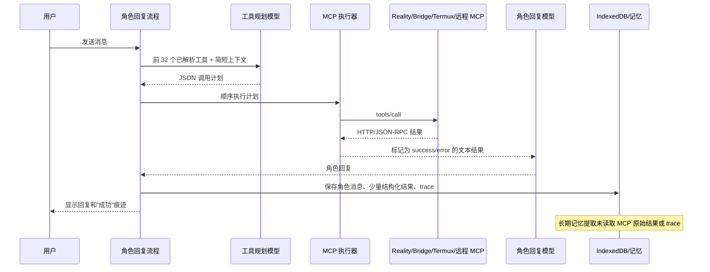
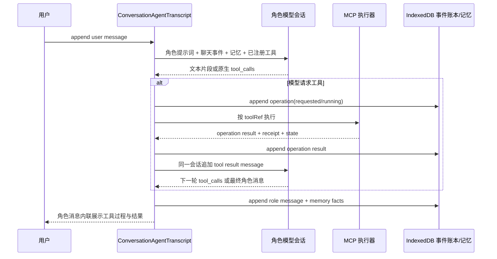
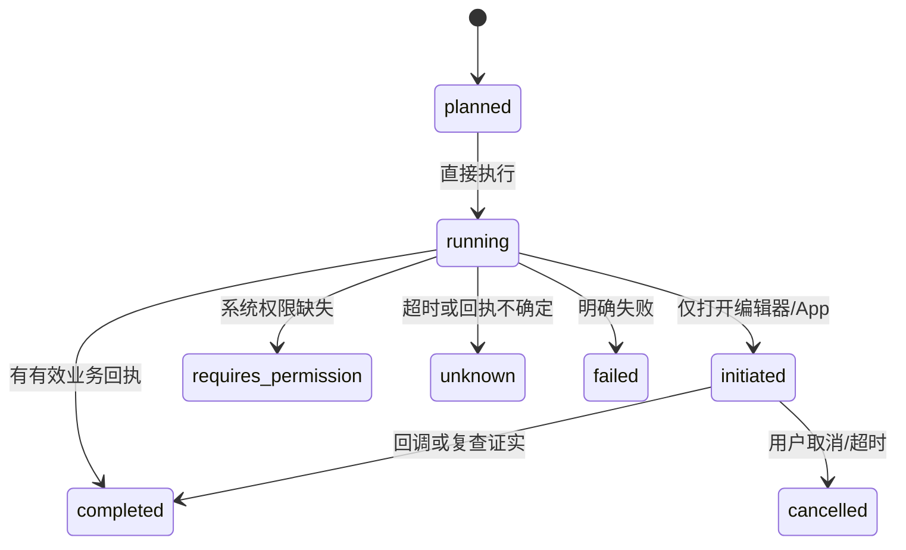

# MCP 全链路审计与修复方案

> 审计日期：2026-08-01  
> 状态：仅审计与方案设计；**未修改任何 MCP 业务代码、原生代码、配置或用户数据。**

## 结论摘要

当前 MCP 的问题不是单一的“权限不够”，而是授权模型、工具发现、执行语义、外部桥接回执、聊天记忆和可观测性彼此断开。用户看到的“调用成功”目前只表示 JSON-RPC/HTTP 层没有报错，不能可靠表示手机、系统 App 或第三方平台已经完成目标动作。

已确认的主要根因如下：

1. 角色规划器最多只看到前 32 个工具，而 Reality MCP 已声明 54 个工具；默认手机能力会挤掉其后的工具和自定义 MCP 工具。
2. 自定义 MCP 导入后先被保存为无工具连接，再异步检测；检测尚未完成或失败时，角色没有可调用工具，但 UI 已提示“已导入”。
3. 当前有总开关、连接策略、单工具开关和角色服务器绑定；目标方案保留“角色绑定服务”，但不保留服务内的工具级权限限制。
4. 内置 Reality MCP 被强制为“浏览并执行操作”，且详情页禁用了该策略选择；权限模型既不够细，也无法将手机能力整体降为只读。
5. 聊天规划器可以直接调用写工具，而 README 仍描述为不能绕过运营中心，产品说明与当前已确认的全权限行为不一致。
6. 闹钟、打开 App、打开系统设置、剪贴板确认、系统权限跳转等“已发起/等待用户确认”动作都被当作“已执行成功”。Android 系统闹钟实际只打开编辑器，不能证明已创建。
7. Bridge 和部分上游仅根据 HTTP 成功判断成功；OneBot/NapCat 或适配器在 HTTP 200 中返回业务失败时，前端仍会把它作为 MCP 成功。
8. MCP 原始结果只在当前轮回复中可用；长期记忆提取没有读取 `mcpResult` 或 `apiTrace`，非结构化工具结果甚至不会持久化为可提取的消息证据。

已确认的产品决策：**应用内 MCP 权限全部放开，但保留角色绑定 MCP 服务。**用户为角色绑定某个已启用服务后，该角色可直接调用该服务的全部已发现工具；不再设置工具级权限、审批、白名单、静默时段、限额或逐次确认。聊天调用不经过运营中心。本文原先将这些控制视为审计风险，它们不再是修复目标。

仍需保留的不是“权限门禁”，而是技术事实：系统权限是否真的授予、工具是否已被发现、外部动作是否真的完成、调用结果如何进入同一聊天上下文和记忆。后续实施应优先完成“全量工具可见、统一聊天工具循环、可区分真实状态、结果事件化记忆”四项基础设施。

## 审计范围与限制

已审计：

- MCP 页面、连接导入、角色绑定、工具发现与远程传输。
- 角色工具规划、工具执行、回复注入、聊天记录、API trace 和长期记忆提取。
- Reality MCP 的提醒、闹钟、日历、备忘录、通讯录、剪贴板、定位、通知、地图与启动 App 路径。
- Android 原生插件、桌面 Bridge、Termux 网关、上游代理与角色运营中心。
- 现有 MCP/记忆回归测试和 TypeScript 构建基线。

未覆盖的边界：

- 本轮没有连接真实第三方平台账号、真实自定义 MCP、Android/iOS 真机或系统日历，因此不能替代设备兼容性验收。
- 未审查第三方社区 MCP 的源码和平台合规性；它们应在接入前单独进行供应链与权限审查。
- 没有修改当前工作区已有的存储/数据中心开发改动。

## 当前调用链



该流程有两次独立模型调用：第一次决定工具，第二次生成回复。虽然 planner 会复制角色设定、摘要、记忆、最近 12 条消息和本轮输入，但它不共享最终回复请求的会话状态、完整提示词或前一请求的隐藏推理；工具结果也只是拼接成一段文本。第一步的静默失败、工具目录截断或结果截断，都会让第二步看不到真实能力或真实动作。

## 线上聊天与 MCP 的统一融合架构

### 产品行为边界

目标不是把 MCP 做成聊天旁边偶尔触发的附属功能，而是让角色把它当作与发文字、看历史、读取记忆同级的原生能力。按已确认的产品策略：

- 每个线上角色直接拥有其**已绑定 MCP 服务**的全部已发现工具，包含 Reality、Bridge、Termux 和自定义连接。
- 不为 MCP 聊天调用增加角色白名单、工具白名单、运营审批、频控、静默时段或二次确认。
- 导入连接成功并完成工具发现后，立即进入全局工具注册表；用户可在角色绑定处选择哪些角色使用该服务，已绑定角色下一轮聊天立即可见策略允许的工具。
- “全部放开”仅指应用内可调用性。系统弹出的授权页、系统闹钟编辑页、外部 App 的后续操作和第三方平台最终回执，仍是客观执行结果，必须如实呈现给角色和用户。

### 核心原则：一份会话事件流

每个 conversation 建立唯一的 `ConversationAgentTranscript`。它不是两份“planner context / reply context”的拼接，而是角色在线聊天的唯一事实来源。所有以下事件按时间顺序写入同一流：

| 事件 | 写入内容 | 在何时对角色可见 |
| --- | --- | --- |
| 用户消息 | 原始消息、附件、引用、发送时间 | 当前轮立即可见 |
| 角色消息 | 最终文本、表情、引用、已关联的工具 operation id | 下一轮作为聊天历史可见 |
| MCP 工具请求 | `toolRef`、完整参数、调用序号、开始时间 | 当前轮后续工具调用与最终回复可见 |
| MCP 工具结果 | 原始结果、标准状态、receipt、错误、完成时间 | 当前轮最终回复立即可见，后续轮次持续可见 |
| 记忆事实 | 从聊天或工具结果提炼的事实、来源 event id、更新时间 | 下一轮和当前轮后续循环可见 |
| 会话摘要 | 被压缩的旧消息和旧工具事件的可追溯摘要 | 超过上下文窗口时可见 |

所有 event 均有稳定 `eventId`；工具调用再有稳定 `operationId` 和 `idempotencyKey`。角色文本、UI 卡片、trace、长期记忆、重试和撤销均通过这些 ID 关联，不再把工具结果只塞进某条角色消息的 `apiTrace`。

### 单一 Agent 工具循环

每一轮线上聊天按以下步骤运行，整个循环使用同一份 canonical transcript：



具体要求：

1. **删除文本 planner 与最终回复的分离。**`generateRoleplayReply()` 直接进入 agent loop，不再先用 `callTextApi()` 让另一个模型输出 JSON 调用计划，再由最终请求猜测结果含义。
2. **优先使用模型供应商原生 function/tool calling。**模型返回 `tool_calls`，宿主执行后把结果以 `tool` message 追加给同一个 conversation。对支持持续会话的 API 使用其 `conversationId` / `previous_response_id`；对无状态 API 则每一次循环完整重放同一份 event transcript。
3. **保留 provider-agnostic 回退。**不支持原生 tools 的模型也使用同一 agent loop：用受严格解析的结构化 `assistant-tool-call` 事件替代原生消息，然后将结果重新写入同一 transcript。回退模式不再单独构造一个较短的 planner prompt。
4. **允许连续调用。**一个工具结果可以触发角色再调用其他工具，例如“读取日程 → 创建提醒 → 发消息”，直到模型输出最终角色消息或到达可配置的循环上限。循环上限是防死循环与费用控制，不是权限限制。
5. **流式呈现。**用户在聊天窗口先看到角色“正在使用：日历 / QQ / 手机”等时间线卡片，最终角色消息与卡片属于同一轮，不再出现聊天回复结束后才突然出现 trace。

这样，角色在完成调用后的语言、情绪、人设和后续动作，确实由它刚获得的工具结果驱动，而不是由第二个独立请求对一段截断文本的复述驱动。

### 全量工具可用，不等于把无限 schema 塞进 prompt

当前 `tools.slice(0, 32)` 必须移除。全权限语义应保证每个工具都可被角色找到并调用；但工具数量无限增长时，模型上下文长度仍是物理限制。推荐采用两层工具注册，而不是恢复为另一种隐性截断：

1. **全量注册表**：IndexedDB 保存所有连接和全部工具，包含稳定 `toolRef = serverId:toolName`、名称、描述、完整 JSON Schema、目录版本。它是角色真实可用的完整集合。
2. **轻量能力索引**：每轮向模型提供全部工具的稳定名称、标题、简短描述和来源服务器；绝不按排序丢弃后段工具。
3. **按需 schema 展开**：模型在同一 agent loop 中调用内部 `mcp_catalog.describe(toolRefs)`，宿主把所需完整 schema 加到下一次同一 transcript 请求；随后模型发起真实工具调用。该目录工具只解决 token 预算，不减少任何角色的工具权限。
4. **直接调用兜底**：若模型已经知道 `toolRef`，执行器从全量注册表加载 schema 并校验/执行，不因该工具本轮未展开而静默忽略。

自定义 MCP 导入完成后应直接更新这个注册表和目录版本。聊天会话在下一轮读取新版本；正在生成的一轮可在下一次 agent loop 刷新目录，避免“刚导入但角色看不到”。

### 统一上下文装配器

新增唯一的 `assembleConversationAgentContext()`，替代 planner 自己的 `mcpPlannerConversationContext()` 与最终回复单独的上下文装配。它每轮从同一数据源按固定顺序构造：

1. 角色设定、线上状态、世界书和当前现实时间。
2. 当前 conversation 的未压缩近期消息及其 MCP event。
3. 当前 conversation 的会话摘要，摘要中必须包含历史 MCP 操作的结果和 receipt，而非仅自然语言聊天。
4. 角色长期记忆及其来源 operation；先加载与本轮消息相关的事实，再加载最近的全局事实。
5. 本轮用户消息、已执行的工具调用/结果、角色尚未完成的意图。
6. 轻量全量工具目录及本轮已展开的 schema。

上下文窗口有限，因此“同一上下文”不应理解为每轮把无限历史原文重复发送。正确做法是保留无损事件账本，在模型窗口内放原文事件，在窗口外放带来源 ID 的递归摘要，并可按需从账本回取原始工具结果。这样既能让角色永远知道“之前调用过什么、结果如何”，又不会因历史不断增长而丢失当前轮工具能力。

### 即时记忆，而非每 25 楼后猜测

目前自动记忆依赖聊天楼层阈值，且提取器没有读取 MCP 结果。统一架构应在 operation 完成时同步写入两类记录：

- **不可丢失的操作事实**：工具、参数、完整结果、状态、receipt、时间、来源 message/event id。它属于会话事件账本，下一轮必定可见。
- **角色长期记忆事实**：从成功操作和角色/用户显式表达中提取的关系、计划、偏好或状态，并引用 operation id。例如“8 月 3 日 14:00 已创建牙医日历事件（event id …）”。

长期记忆提取在每个工具循环结束后执行，不等待 25 条聊天消息；提取失败不影响 operation 账本，下一轮仍可直接读取原始结果。工具调用失败、需要系统确认、用户取消或结果未知也写入事件流，让角色准确说“还没完成”，但不将其写成已完成的长期事实。

### 聊天 UI 的融合方式

线上聊天每一轮显示一个可展开的“角色行动”时间线，置于角色最终消息之前或作为其内联附件：

- `已调用`：展示服务器、工具、参数摘要和开始时间。
- `已完成`：展示核心结果、receipt、可进入对应页面的链接（如备忘录/日历记录）。
- `已发起`：展示“已打开系统页面/App，等待你完成后续操作”。
- `待系统授权`、`未完成`、`结果未知`：展示真实状态和原始错误摘要，不伪装成聊天文本成功。

角色最终回复直接引用同一 operationId 产生的结果；点击卡片可以查看完整结果、再次查询、取消或打开相关本地记录。MCP Studio 只负责连接管理和调试，不再是用户理解“角色刚才做了什么”的唯一入口。

### 建议的数据模型

```text
ConversationAgentEvent
  id, conversationId, turnId, sequence, type,
  messageId?, operationId?, payload, createdAt

McpOperation
  id, conversationId, turnId, parentOperationId?,
  toolRef, serverId, toolName, arguments, result,
  state, receipt, idempotencyKey, startedAt, completedAt

ConversationAgentSnapshot
  conversationId, eventCursor, summary, summarySourceEventIds,
  memoryFactIds, toolCatalogVersion, updatedAt
```

`ChatMessage` 只保存本轮可渲染的文本与 `operationIds`；完整 MCP 数据存入 operation/event 表。`buildPrompt()`、聊天渲染、trace 页面和 `memoryExtraction.ts` 都从同一 `ConversationAgentTranscript` 读取，不再各自挑选不同字段。

## 已确认问题清单

### P0：必须优先处理

| 编号 | 问题与证据 | 影响 | 修复方向 |
| --- | --- | --- | --- |
| MCP-001 | `src/services/ai.ts:3002` 定义 `maxMcpPlannerTools = 32`，`src/services/ai.ts:3042` 直接 `slice(0, 32)`；`src/data/realityMcp.ts` 声明 54 个 Reality 工具。 | `create_memo`、`list_memos`、`set_alarm`、打开 App 等靠后的内置能力，以及默认排序后面的自定义 MCP 工具，对角色完全不可见。 | 删除全局前 32 截断；改为按服务器/类别配额、相关性检索或分页目录，并在 UI 展示“本轮实际提供给角色的工具”。 |
| MCP-002 | `src/components/mcp/mcpStudio.ts:321-345` 与 `:388-415` 先保存空 `tools`，再以 `void inspectServer(...)` 后台检测。 | 导入后立即聊天时，角色无工具可见；检测失败或跨域失败容易被用户误判为“角色看不到自定义 MCP”。 | 导入与检测改为原子流程：状态为“检测中、不可调用”，只有检测成功且工具列表落库后才能启用/绑定；允许显式暂存失败连接。 |
| MCP-003 | `src/data/realityMcp.ts` 将内置 Reality 连接默认设为 `toolPolicy: 'all'`；旧实现在 `src/utils/settings.ts` 强制覆盖为 `all`，且 `McpServerDetailPanel.vue` 对 builtin 禁用策略选择。 | 这会抹掉用户设置的只读、禁用和逐工具状态，并让内置服务无法采用与远程服务一致的控制方式。 | 默认保持 `all`，但保留每个服务的策略与逐工具开关；角色绑定与服务策略分开呈现，系统权限状态独立显示。 |
| MCP-004 | `src/services/ai.ts:3062-3117` 允许线上角色自主执行任意 `write=true` 工具；`src/services/roleOperations.ts:249-306` 的审批、白名单、静默时段、额度只在运营中心调用时生效。 | 聊天角色直连写工具正是本次确认的产品行为；现有 README 描述与实际行为不一致，且聊天与运营中心形成两套行为模型。 | 聊天保持直接执行；从 MCP 聊天路径彻底移除运营中心 policy gate 的依赖，并把 README/界面文案改为“线上角色可直接调用全部 MCP 工具”。 |
| MCP-005 | `src/services/mcp.ts:570-588` 只以 MCP `isError` 区分成功；`src/services/ai.ts:3164-3185` 将非 `isError` 均记为 success，并明确告诉回复模型“已经执行完成”。 | “打开 App/设置”“等待系统确认”“业务已拒绝”“结果未知”均可能被角色说成成功。 | 引入标准执行状态：`completed`、`initiated`、`awaiting-user`、`requires-permission`、`unsupported`、`unknown`、`failed`。只有 `completed` 可称为完成。 |
| MCP-006 | `bridge/babylink-bridge.mjs:491-509` 只要 `requestJson` 没有 HTTP 错误就审计为成功；OneBot/适配器的 `status`、`retcode`、`ok:false`、平台回执 ID 未被校验。 | 第三方平台不写入、登录失效、目标不存在时仍可能显示 MCP 成功。 | 为每类适配器建立严格结果适配器，校验业务状态与最小 receipt；缺少 receipt 时标为 `unknown` 或 `initiated`。 |
| MCP-007 | `src/services/memoryExtraction.ts:267-282` 的 `renderMessageContent()` 不读取 `message.mcpResult` 或 `message.apiTrace`；`src/stores/appStore.ts:8649-8663` 仅把可归一化的搜索结果另存为消息卡。 | 工具调用结果不会稳定进入长期记忆。写操作、普通文本结果、失败原因和外部回执尤其容易丢失。 | 持久化脱敏的 MCP operation 记录；将可记忆的已确认事实以受控系统证据送入记忆抽取，并保留 operation/message 关联。 |
| MCP-008 | `src/services/realityMcp.ts:1402-1413` 的 `set_alarm` 只传递小时和分钟到 Android；`android/app/src/main/java/top/babylink/app/LinkRealityPlugin.java:142-168` 使用 `ACTION_SET_ALARM` 且 `EXTRA_SKIP_UI=false`。 | 这只是打开系统时钟编辑界面，用户可能取消；日期信息被丢弃，不能创建精确的一次性闹钟，却被当前流程当成已设置。 | 将能力改名为“打开系统闹钟编辑器”，结果只能是 `awaiting-user`；一次性精确提醒使用本应用通知。若将来接入可验证的 OEM/API，再单独声明支持。 |

### P1：高优先级可靠性与体验问题

| 编号 | 问题与证据 | 影响 | 修复方向 |
| --- | --- | --- | --- |
| MCP-009 | `src/services/mcp.ts` 依赖命名启发式推断只读/写入；中文名、`open_*`、非英语工具和含义特殊的工具会误分类。 | 错误分类会使只读策略错误放行写工具，或错误隐藏可用工具，也会让聊天 UI、结果文案和记忆误解动作类型。 | MCP 工具模型增加仅用于展示与语义的 `actionKind`；服务端 annotations 优先，未知工具在只读策略下默认不放行并在事件卡中标为“动作类型未知”。 |
| MCP-010 | `src/services/ai.ts:3073-3075` 对同名工具要求唯一；规划模型若遗漏 `serverId`，多个服务器同名工具会被静默丢弃。 | 多连接环境出现“模型明明选择了工具但没有调用”。 | 调用格式使用稳定的 `toolRef = serverId:toolName`；无法消歧时返回可见的规划错误，而不是静默丢弃。 |
| MCP-011 | `src/services/ai.ts:3124-3127` 吞掉规划器异常并返回空调用，没有 trace 或用户可见状态。 | API/JSON 失败、目录过大、模型拒绝时被表现为“角色没想调用”。 | 保存每轮 planner 状态、目录版本、拒绝原因和重试建议；聊天 trace 中单独显示“规划失败”。 |
| MCP-012 | 工具计划只检查 arguments 是对象，未在客户端执行 `inputSchema` 必填、类型、范围、枚举和 `additionalProperties` 校验。 | 无效参数流向远程服务；服务宽松时还会产生半成功或错误动作。 | 使用 JSON Schema validator；在调用前做 deterministic validation、规范化和必要的日期/QQ 号规则校验。 |
| MCP-013 | `src/services/realityMcp.ts:736-760` 先写入提醒到设置，再安排系统通知。后续调度失败会让操作报错但本地提醒已存在。 | UI、模型描述、本地数据和系统通知状态不一致。 | 采用 operation 状态机和补偿事务：先预写 `pending`，调度成功后 `completed`；失败时回滚或保留为明确“未投递”。 |
| MCP-014 | `reminderSchedule()` 只表达日/周/月/年基本循环；`repeatInterval`、`repeatEndAt`、`repeatCount`、`repeatWeekdays` 未落实到系统调度，且 `set_reminder`/`update_reminder` schema 没有公开全部重复字段。 | 用户设置的重复规则与系统实际通知不一致。 | 先定义所有平台的重复能力矩阵；不支持的字段必须拒绝或降级为应用内重算，不能静默伪装支持。 |
| MCP-015 | `openExternalUrl()` 及 `open_mobile_app` 只确认 URL/Intent 已交给系统；网页分支甚至不检查弹窗是否被拦截。 | “软件已打开、路线已打开、电话已拨出”等叙述不可证明。 | 对 launch 类操作统一返回 `initiated`，显示目标 URL/包名；不能声称用户已经看到目标页面或完成后续操作。 |
| MCP-016 | `get_app_usage`、通知收件箱访问等可返回 `permissionGranted:false`/`granted:false` 但仍作为普通 success；剪贴板与清空通知返回 `approved:false` 也不是错误。 | 角色可能把“没有数据/用户拒绝/需要授权”误说成“已读取/已清空”。 | 将业务结果转换为统一状态；`requires-permission`、`declined` 不能走 success 文案。 |
| MCP-017 | 系统敏感能力由自动角色调用时直接触发权限请求：位置、日历、通讯录、通知读取等没有独立用户确认门。 | 在线角色可在不清晰的用户意图下弹出系统权限；隐私控制不透明。 | 权限请求只能由权限中心中的用户手势发起；角色只可读取已授予且已允许角色使用的能力。 |
| MCP-018 | `resolveMcpTools()` 只看设置，不看连接最新健康状态；检测失败的连接若保留旧工具，仍会进入模型目录。 | 角色反复尝试已离线连接，造成无意义失败与噪声。 | 引入连接状态、工具目录版本与最近成功检查阈值；离线连接默认不可规划，支持“允许离线重试”的显式选项。 |
| MCP-019 | `src/services/mcp.ts:456-499` 的工具发现只在手动检查/导入后更新，没有目录指纹、变更通知或失效标识。 | 服务端工具改名、权限变更、登录失效后，本地目录长期陈旧。 | 保存 `catalogHash`、发现时间、协议版本；进入角色授权/聊天前按 TTL 轻量检查，目录变化后要求重新审核新增写工具。 |
| MCP-020 | 远程调用断线时写工具只报 error，状态模型没有表示“可能已执行”；读取工具可自动重试。 | 用户无法判断该不该重试，容易产生重复消息、重复发帖或重复写入。 | 为所有写操作生成 idempotency key；桥接/上游返回 operation id；超时后记 `unknown` 并提供“查询回执/人工确认”，禁止盲目重试。 |

### P2：完整性、安全与可维护性问题

| 编号 | 问题与证据 | 影响 | 修复方向 |
| --- | --- | --- | --- |
| MCP-021 | Bridge 的 QQ 白名单和可写工具白名单为空时不限制写操作，见 `bridge/lib/security.mjs:17-25`。 | 在已确认的全权限模式下，聊天模型可向任意 QQ 用户/群发送消息。 | 保持直接写入；在聊天事件中完整记录目标、参数、平台 receipt 和实际业务结果，供角色下一轮与用户回看。 |
| MCP-022 | Bridge `/health` 对未认证请求公开平台配置摘要；会话集合无过期清理。 | 信息泄露面和长期运行资源占用增加。 | 健康接口只返回最小信息或要求本地/认证访问；为会话设置 TTL、数量上限和清理计时器。 |
| MCP-023 | Termux `toolPayload()` 会把没有 MCP error 的任意普通对象包装为 `isError:false`；上游逻辑失败可能被升级为成功。 | 与 Bridge 相同的假成功问题会在 Termux 上游复现。 | 统一 adapter result contract；保留上游 `isError`，校验 `ok/status/code`，映射到标准状态。 |
| MCP-024 | Termux 分享链接读取在达到字节上限时截断内容，但完成状态仍可为 `complete`。 | 模型将不完整正文当成完整事实。 | 返回 `truncated:true`/`partial`，并在回复提示中禁止把截断内容表述为全文。 |
| MCP-025 | 生产代理与部分 Termux URL 校验先 DNS 解析、再按主机名 fetch，存在 DNS rebinding 防护不足的风险。 | 受会话保护的代理可能被恶意公网域名诱导访问后续解析到的私网地址。 | 将已验证 IP 固定用于连接，或使用具备 rebinding 防护的受控 HTTP client；每次重定向与实际连接地址都重新验证。 |
| MCP-026 | `McpToolDefinition` 只保存 `write:boolean`，无法表示数据敏感度、是否需系统权限、是否可撤销、确认方式、回执类型。 | 新工具继续依赖启发式，难以安全扩展。 | 扩展为 capability manifest；未知字段默认最小权限，新增权限需要用户重新审核。 |
| MCP-027 | API trace 只附在本轮第一条角色消息，结构化卡、结果、实际操作和失败之间没有稳定 operation id。 | 排障、重试、撤销、记忆、数据导出都难以关联。 | 将 trace 改为独立 `mcpOperations` 实体，消息仅引用 operation id 列表。 |
| MCP-028 | 现有回归仅验证结果卡归一化和通用记忆图谱，不覆盖工具目录、授权决策、真实回执、Android 行为或导入竞态。 | 当前测试全绿仍不能说明 MCP 可用或安全。 | 按本文“验收与测试矩阵”补足单元、集成、真机和故障注入测试。 |

## 专项说明：闹钟、提醒、日程与备忘录混淆

当前提示词确实声明“备忘录只能用 `create_memo`、不能用 `set_reminder`”，但这不足以保证正确性：工具选择仍完全由模型生成，工具目录被截断时备忘录工具甚至不可见，且没有调用前的确定性意图校验。

应把四类意图设计为互斥领域动作，而不是相近名称的模型自由选择：

| 用户目标 | 唯一领域动作 | 是否要求时间 | 完成条件 |
| --- | --- | --- | --- |
| 保存文字、便签、笔记 | `create_memo` | 否 | IndexedDB 事务提交且返回 memo id |
| 到某时提醒 | `create_reminder` | 必须未来时间 | 提醒记录和投递计划都成功；否则显示未投递 |
| 倒计时 | `create_timer` | 必须时长 | 平台支持的定时器计划成功 |
| 系统时钟闹钟 | `open_system_alarm_editor` | 可提供建议时间 | 仅“已打开编辑器，等待用户确认”；不能声称已创建 |
| 日历事件 | `create_calendar_event` | 开始/结束时间 | 日历插件返回非空稳定 event id，且本地映射提交成功 |

修复时必须在 planner 之前运行 `classifyLifeIntent()`：根据结构化用户请求、明确时间和用户确认选择领域动作；模型只能补齐合理参数，不能跨类别替换。无法判断时应追问，不得把备忘录、日程和闹钟默认为提醒。

## 全权限 MCP 与系统状态中心

不再设计运营中心式的审批、白名单、静默时段或额度权限中心。MCP Studio 展示全部连接、全部工具、每个角色已绑定的服务和系统实际能力；角色绑定决定角色是否看见一个服务，服务自身的读写策略与逐工具开关则决定其中哪些能力可调用。

### 1. 默认全开，保留服务级控制

- 新增连接默认 `toolPolicy: 'all'`，新发现工具默认 `enabled: true`；用户可显式改为 `read-only`、`disabled` 或关闭单个工具。
- 保留“角色绑定 MCP 服务”选择器；角色未绑定服务时不会看见该服务，已绑定时只看见服务策略允许且已启用的工具。
- 导入连接、Bridge 配对和 Termux 上游发现成功后才进入服务列表；目录更新时保留既有工具的启用状态，新增工具按默认启用加入目录。
- 聊天中的 MCP 调用直接执行，不生成运营任务，不读取 `roleOperations` 的审批、额度、白名单或时间规则。

旧设置迁移时，已有的 `disabled`、`read-only` 和单工具关闭原样保留；已有 `mcpBinding` 原样保留。MCP 页面保留“连接是否启用”“服务读写策略”“逐工具开关”“角色绑定服务”和“移除连接”。

### 2. 系统状态不是应用内授权

即使应用内配置允许调用，设备平台仍会报告它实际能不能执行。页面按能力展示：

- 通知展示/读取、定位、日历、通讯录、App 使用记录、剪贴板。
- Android 使用情况访问、通知监听、系统闹钟编辑器、Termux:API。
- iOS/浏览器的原生支持、前台限制与 PWA 可用性。

角色可以直接调用对应工具；如果系统权限未授予，结果事件记录为 `requires-permission` 并将系统设置入口作为结果返回。用户也可以在状态中心主动打开设置和刷新状态。这个页面的目的只是解释为什么执行结果不同，不是在应用内阻止角色调用。

### 3. 全量工具目录

连接详情应显示实际目录版本、目录 hash、上次发现、上次调用、健康状态和完整工具列表。每项工具展示稳定 `toolRef`、完整 schema、来源服务器和最近调用结果；不展示“可否授予角色”的控件。

新服务器或新增工具无需审核才可用于聊天，但目录必须先完成技术发现，避免空工具列表或陈旧 schema 被送入角色会话。连接失败时保留诊断信息，修复后重新发现即可恢复所有工具。

### 4. 全量结果可见性

聊天 trace、操作历史、消息导出和角色记忆均关联完整 `McpOperation`。为满足“同一上下文和记忆”，MCP 原始参数与原始结果作为会话事件保存；UI 使用摘要显示，展开后可查看原始 payload。用户可单独删除某个 operation 或清空会话，而不是让系统默认丢弃工具事实。

## 统一执行与回执设计

新增 `McpOperation` 领域实体并存入 IndexedDB（建议单独 `mcpOperations` store，按 conversation、角色、连接、状态和时间建立索引）。消息只保存 operation id 引用，避免把大结果与敏感数据复制到多处。

最小字段建议：

```text
id, idempotencyKey, conversationId, turnId, characterId, serverId, toolName,
toolRef, arguments, rawResult, requestedAt, startedAt, completedAt,
status, receipt, summary, retryOf, errorCode
```

状态转换必须受限：



回执要求：

- **本地备忘录**：数据库提交后的 memo id。
- **提醒/通知**：本地 reminder id、系统 notification id、计划时间、投递平台；浏览器必须标记非持久。
- **日历**：非空系统 event id；若插件无法返回稳定 id，操作必须是失败/未知而非成功。
- **启动 App/系统设置/系统闹钟**：只能返回 `initiated`，绝不返回 `completed`。
- **Bridge OneBot**：校验 `status === 'ok'`、成功 retcode 和可选 `message_id`；无 message id 的发送应标为未知并提供查询。
- **第三方适配器**：定义统一 `{ ok, state, receipt, error }` 契约，拒绝把任意 HTTP 200 视为成功。
- **超时写操作**：先查询 idempotency key/operation id；无法确认则 `unknown`，不自动重试。

执行状态不是权限门禁，而是角色与用户共用的事实。角色回复应直接基于状态生成，不能交给自然语言模型猜测：

- `completed`：可说“已经创建/已发送”，并可给出可点击/可管理的记录。
- `initiated`：只能说“已打开，等你在系统界面确认”。
- `requires_permission`：只能说“还缺少某项系统授权”。
- `unknown`：只能说“结果未确认，先不要重复操作”。
- `failed`：必须展示可操作错误和重试条件。

## 角色记忆与结果保留设计

结果应分为三个层次，确保所有 MCP 调用都与线上聊天和记忆连通：

1. **本轮上下文**：当前 agent loop 立即接收完整工具结果和状态，再继续生成角色消息。
2. **会话事件账本**：`McpOperation` 保存原始参数、原始结果、receipt、错误和摘要；后续每一轮均可从同一 conversation 读取。
3. **长期角色记忆**：每个操作结束后立刻从结果提取可长期复用的事实，例如“用户选择了周六 14:00 的日历事件”“备忘录保存了购物清单”。

长期记忆规则：

- `requires_permission`、`cancelled`、`failed`、`unknown` 同样进入事件账本与短期聊天历史，但不能被写成“已经完成”的长期事实。
- 成功的通讯录、通知、定位、剪贴板、外部账号和自定义 MCP 结果均可进入角色长期记忆，不另设记忆权限开关。
- 每条记忆证据都引用 operation id 和消息 id；操作撤销、日历删除、提醒取消或查询到新状态时立即写入修正事件，使旧断言失效。
- `renderMessageContent()`、`buildPrompt()` 和 `memoryExtraction.ts` 统一读取 operation event，原始 payload 与面向模型的摘要来自同一个来源。

## 分阶段实施计划

### 阶段 0：建立统一角色会话

1. 以 `ConversationAgentTranscript` 替换“文本 planner → 独立最终回复”的双请求路径。
2. 接入原生 tool calling 与 provider-agnostic 回退，形成同一 transcript 的多轮 agent loop。
3. 让每个角色直接读取自己已绑定服务器中策略允许的工具；保留角色绑定、读写策略和逐工具状态，移除运营中心调用分流。
4. 将 `set_alarm` 改为“打开闹钟编辑器”的真实状态，不再报告已创建。

### 阶段 1：恢复全量工具发现

1. 删除 32 工具全局截断，建立全量注册表、稳定 `toolRef`、轻量目录与按需 schema 展开。
2. 导入流程改为“保存草稿 → 检测成功 → 默认全开 → 选择绑定角色”；检测中仅作为技术未就绪状态，不是权限状态。
3. 保留旧 `disabled`、`read-only` 和单工具开关，并原样保留角色 binding。
4. 建立系统状态中心，展示原生权限、平台限制、连接健康和完整目录，不控制角色调用。

### 阶段 2：执行状态机与真实回执

1. 新建 `mcpOperations` 数据库表、状态机、幂等键和 trace 引用。
2. 重构 Reality MCP：事务化提醒、平台能力矩阵、明确 launch/permission 状态、日历 ID 验证。
3. 重构 Bridge/Termux adapter：业务成功校验、receipt 规范、直接写入和查询接口。
4. 将自然语言回复与操作状态绑定，消除“模型自行声称成功”。

### 阶段 3：记忆与聊天可观测性

1. 将完整 operation event 接入短期上下文、会话摘要和即时长期记忆。
2. 移除 MCP 聊天对运营中心 policy gate 的依赖；外部写操作作为聊天 agent loop 的直接步骤。
3. 增加 MCP 操作历史：筛选、重试、确认未知结果、撤销/取消、导出完整事件。
4. 增加连接诊断：DNS/证书、CORS、鉴权、目录变化、权限缺失、原生插件可用性、最近失败。

### 阶段 4：兼容迁移

1. 保留旧 `enabled/globalEnabled/toolPolicy/mcpBinding` 的读取兼容，并保留已有服务内策略和 `mcpBinding`。
2. 新工具默认启用，工具发现完成后即按照服务策略加入已绑定角色的目录；角色 binding 继续由用户维护。
3. 保留历史聊天 trace；为旧调用标记 `legacy-unverified`，不要伪造新 receipt。
4. 备份/恢复必须包含完整 operation 事件、会话摘要和长期记忆，并继续剔除 API Key、Token、Cookie、系统权限状态缓存。

## 验收与测试矩阵

### 必须新增的自动化测试

- 工具发现：Reality 工具超过 32 时，自定义 MCP 的工具仍能被选中；同名工具通过 `toolRef` 精确路由。
- 导入竞态：检测前不可调用；检测成功原子启用；失败连接不进入 planner。
- 策略路由：仅当服务已启用、角色已绑定或继承服务、服务策略允许且工具未停用时，线上角色才可直接调用；运营中心配置不得影响路由。
- Schema：缺失必填字段、错误类型、超范围日期、错误 QQ 号、额外参数都在本地阻止。
- 状态：`completed/initiated/requires_permission/unknown/failed` 的回复文案、事件账本和 trace 完全不同。
- Android mock：闹钟编辑器只能为 `initiated`；提醒调度失败后没有“已投递”；日历空 ID 不能成功。
- Bridge contract：OneBot HTTP 200 + `status: failed`、适配器 `{ok:false}`、无 receipt、超时均不得成 success。
- 记忆：全部 MCP 调用的原始参数与结果进入会话事件；成功备忘录、日历、定位、通知和自定义结果均能进入长期记忆；失败操作不能被编码成已完成事实。
- 幂等：写操作网络中断后二次请求带同一 idempotency key，不产生重复消息/评论/记录。
- 传输可靠性：DNS 重绑定、重定向到私网和超大响应被阻止，且失败原因作为 MCP event 返回角色会话。

### 真机与端到端验收

| 场景 | 预期结果 |
| --- | --- |
| Android 首次授权日历/定位/通知读取 | 角色可直接调用；系统弹窗或设置跳转的结果立即写入同一会话，授权完成后下一轮自动读取新状态。 |
| 写备忘录 | 返回 memo id，备忘录页面可见，操作历史为 `completed`，下一轮和长期记忆立即记住。 |
| 创建提醒后拒绝通知权限 | 提醒记录显示“未投递/需要通知权限”，角色不得声称已提醒。 |
| 打开系统闹钟 | 仅显示“已打开编辑器，等待确认”；用户取消后不得保留完成记录。 |
| 创建日历事件 | 手机日历出现事件，系统 event id 非空，操作历史可定位；删除后记忆被修正。 |
| 导入自定义 MCP | 检测成功前显示技术未就绪；成功后选择绑定角色，默认启用的工具按服务策略加入这些角色的目录，线上聊天立即可调用。 |
| 两台连接有同名工具 | UI 与 trace 明确显示实际服务器；不会静默丢调用。 |
| Bridge QQ 业务失败 | 页面与角色均显示失败原因，不显示成功；没有 `message_id` 时状态为未知。 |
| Bridge 写操作 | 角色在线上聊天中直接执行；同一轮显示平台业务 receipt，下一轮角色和长期记忆都能读取该结果。 |
| PWA 后台提醒 | 明确显示“尽力运行、非持久”；不与 Android 原生持久通知混为一谈。 |

## 当前测试基线

已运行：

| 命令 | 结果 | 覆盖边界 |
| --- | --- | --- |
| `npm run test:mcp-results` | 通过 | 仅验证搜索/商品等结果卡归一化。 |
| `npm run test:memory` | 通过 | 仅验证通用记忆图谱与楼层逻辑，不含 MCP operation。 |
| `npm run build` | 未通过 | 被当前工作区既有数据中心/存储改动阻断：缺少 `DataManagementPanel.vue`、`storageInventory.ts` 类型错误及 `appStore.ts` 未定义数据引用；这些问题不属于本次 MCP 审计，也未被修改。 |

因此，“现有 MCP/记忆测试通过”只能证明少量纯函数回归未退化，不能证明全量自定义 MCP 可见、统一聊天工具循环、外部动作实际完成或结果会被角色长期记住。

## 建议的交付顺序

1. 先实现统一 `ConversationAgentTranscript`、native tool loop、operation event 和即时记忆，使线上聊天与 MCP 真正使用同一上下文。
2. 紧接着删除 32 工具截断，完成导入即全局自动启用、角色服务绑定和旧配置“服务内全开”的迁移。
3. 再补齐 Reality、Bridge、Termux 的真实业务 receipt、幂等和未知结果查询，保证角色得到的事实与设备/平台实际一致。
4. 最后完成聊天内联行动卡、操作历史、动态 schema 展开、会话摘要和真机三链路验收。

这套顺序优先解决“角色看得见所有工具”“工具结果就是聊天上下文”“角色会立刻记住结果”“成功与未完成不再混淆”四个用户可感知问题，并保持所有 MCP 能力在应用内直接可用。