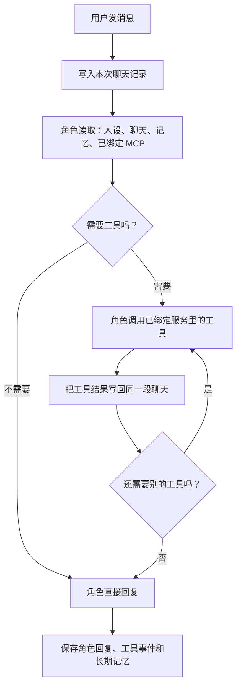

# MCP 和线上聊天一体化：小白版完整方案

> 这是产品方案，不是代码改动。  
> 已确定的规则：**角色绑定哪些 MCP 服务由用户决定；服务默认全开，但角色只能调用服务策略允许且未被逐项停用的工具。**

## 一句话目标

让角色像真人一样在聊天里使用手机、日历、QQ、搜索或自定义工具：它会记得自己刚刚做了什么，下一句话能自然接着说，下一次聊天也不会忘记。

例如：

1. 用户说：“帮我记一下，明天上午十点交作业。”
2. 角色在聊天里调用提醒工具。
3. 聊天中出现“正在创建提醒”的小卡片。
4. 工具返回结果后，角色马上说：“已经帮你记好了，明天上午十点提醒你交作业。”
5. 下次用户问“我明天有什么事？”时，角色不仅能看见提醒，还知道这是自己之前创建的。

这就是“聊天、MCP、记忆是同一个东西”，而不是角色说完话以后在背后偷偷跑一个工具。

## 先认识三个词

| 名词 | 小白解释 |
| --- | --- |
| MCP 服务 | 一个工具箱。例如手机工具箱、QQ 工具箱、搜索工具箱、你导入的自定义工具箱。 |
| 角色绑定 MCP | 决定哪个角色拿到哪个工具箱。例如“小林”能用手机和日历，“小周”只能用搜索和 QQ。 |
| 服务内工具默认全开 | 新增工具箱默认允许所有工具；用户仍可为服务选“只读/禁用”，或单独关闭某个工具，不走运营中心审批。 |

因此，角色绑定不是“工具权限限制”，而是给角色分配不同工具箱的方式。它应当保留。

## 最终使用规则

### 1. 连接层：先把工具箱接进来

用户在 MCP Studio 添加一个服务：

- 内置手机 Reality MCP。
- 桌面 Bridge，例如 QQ、XHS、抖音。
- Termux 网关。
- 用户自己导入的 MCP 地址。

系统先读取这个服务真正提供了哪些工具。读取成功后，服务进入“可用服务列表”。这一步只是检查连接和获取工具说明，不是让角色立即使用。

### 2. 角色层：选择谁使用哪个服务

每个服务详情页保留“绑定角色”区域，例如：

| 服务 | 已绑定角色 | 结果 |
| --- | --- | --- |
| Reality 手机工具 | 小林、小夏 | 小林和小夏能用该服务中已启用且策略允许的手机工具。 |
| QQ Bridge | 小林 | 只有小林能使用 QQ 中已启用且策略允许的工具。 |
| 自定义天气 MCP | 小夏、小周 | 小夏和小周能使用该服务中已启用且策略允许的工具。 |

服务默认允许全部工具；需要收紧范围时，可在服务设置中选择“只读”或“禁用”，也可逐项关闭工具。角色绑定只决定角色能使用哪些服务，不覆盖服务自身策略。

取消绑定的效果也很简单：这个角色之后看不见、也不会调用这个服务；其他已绑定角色不受影响。

### 3. 聊天层：角色把工具当作自己的能力

线上聊天时，角色只会看见：

1. 自己的人设和当前状态。
2. 用户和自己之前的聊天。
3. 自己长期记得的事情。
4. 自己已绑定 MCP 服务的完整工具目录。
5. 已绑定服务中策略允许的工具，以及本轮聊天里已经调用过的工具和返回结果。

它看不见未绑定服务，因此不会误用其他角色的工具；但看见一个已绑定服务后，服务里的所有工具都能直接调用。

## 现在为什么不够自然

当前流程像两个不同的人轮流工作：

```text
第一个“小助手”：只看一部分聊天，猜要不要调用工具
        ↓
工具执行
        ↓
第二个“角色”：再看一段工具结果，生成聊天回复
```

这会造成四种常见问题：

- 第一个小助手没看见某个工具，角色就无法使用。
- 第一个小助手和最终角色看到的上下文不完全一样。
- 工具结果只是临时塞进回复，下一次聊天或长期记忆可能没有它。
- 工具只是“请求发出去了”，角色却容易说成“已经完成”。

## 新流程：同一个角色连续思考和行动

新流程只保留一个角色会话。它可以在同一轮聊天里多次使用工具，再给用户最终回答：



关键点是：工具结果不是给另一个模型看的“附加说明”，而是角色当前聊天的一条正式事件。

## 一段真实聊天会发生什么

用户说：“我下午三点有空吗？有空就给我建个和医生的日程。”

1. 角色看到这句话，也看到此前的聊天和记忆。
2. 角色先调用日历查询工具。
3. 聊天里出现一张小卡片：“小林正在查看日历”。
4. 日历返回“15:00 至 16:00 空闲”。
5. 这个结果立刻回到**同一个角色会话**。
6. 角色继续调用创建日历工具。
7. 日历返回事件编号。
8. 角色说：“下午三点有空，我已经创建了和医生的日程。”
9. 聊天记录保存两次工具调用、事件编号和角色回复。
10. 记忆立刻保存“用户下午三点有医生日程”，以后可以继续使用。

如果日历没有空闲，角色会直接根据查询结果回答“这个时间已有安排”，不会假装创建成功。

## “同一个上下文”和“同一个记忆”具体怎么做到

### 本轮绝不丢

每次工具调用都会成为本轮聊天的一条事件。角色调用第二个工具或生成最终回复时，都能读到第一个工具的结果。

例如，角色先读取通讯录找到“张医生”，再创建日程时会直接使用刚得到的联系人信息，不需要用户重新告诉它。

### 下次聊天还能记得

聊天结束后，工具调用会保存到这段对话的“行动记录”里，内容包括：

- 调用了哪个服务、哪个工具。
- 传了什么参数。
- 工具返回了什么。
- 是否完成、是否只是打开了系统页面、是否失败。
- 日历事件编号、备忘录编号、QQ 消息编号等结果编号。

下次和同一角色聊天时，这些行动记录会和普通聊天一起被读入。角色会知道“这件事是我上次帮用户做的”。

### 长期也能记得

每次工具结束后，系统马上从结果里提取值得长期记住的事实，而不是等到聊了很多条消息以后再猜。

例如：

- 创建日程后记住日期、时间、事项和事件编号。
- 写备忘录后记住标题和编号。
- 查到天气后可记住用户正要去哪里、需要带伞这类聊天事实。
- 发 QQ 后记住发给谁、说了什么、是否发送成功。

如果后来取消提醒、删除日程或重新查询到不同结果，新的结果会覆盖旧记忆，角色不会一直记错。

### 聊天太长怎么办

聊天不可能无限长地全部塞给模型。解决方法不是忘掉工具结果，而是：

- 最近的聊天和最近的工具结果保留原文。
- 很早以前的聊天压缩成摘要。
- 每份摘要记住它来自哪些旧消息和工具记录。
- 当角色问到旧事情时，可以从保存的行动记录中重新取回原始结果。

因此，角色会“记住”，同时聊天不会越来越慢。

## 工具很多怎么办

不能再只把前 32 个工具给角色看。正确做法是：

1. 系统保存所有 MCP 服务和所有工具的完整清单。
2. 聊天开始时，角色看见自己已绑定服务中策略允许的工具名称和简短说明。
3. 如果某个工具参数特别复杂，角色在聊天过程中先查看该工具的完整说明，再正式调用。
4. 每个工具有固定编号，例如“QQ 服务:发送消息”，不会因为两个服务有同名工具而弄错。

这代表“所有工具都能用”，而不是把无限长的工具说明塞进一次请求里导致聊天崩掉。

## 聊天里应该长什么样

工具调用不应该只藏在调试页面。用户在普通聊天里就能看见角色行动：

| 卡片状态 | 用户看到的意思 |
| --- | --- |
| 正在调用 | 角色正在使用某个工具。 |
| 已完成 | 工具给出了明确结果，例如拿到了日历事件编号。 |
| 已发起 | 已打开系统 App、系统设置或闹钟编辑器，后面需要用户在系统界面继续操作。 |
| 需要系统授权 | MCP 已经允许调用，但手机系统还没有授予这项能力。 |
| 失败或未知 | 角色没有拿到确定结果，会如实说明。 |

工具卡片可以展开，查看参数、完整结果和对应本地记录。角色最后说的话必须依据卡片状态生成。

## 闹钟、提醒、日程和备忘录要分清

用户说的话 | 角色应做的事
--- | ---
“帮我记一下买牛奶” | 创建备忘录，不设置时间。
“明天早上八点提醒我吃药” | 创建提醒，需要时间和通知计划。
“下午三点和医生见面” | 创建日历日程，需要开始和结束时间。
“帮我设一个系统闹钟” | 打开系统闹钟编辑器；只能说“已打开，等你确认”，不能说“已设置完成”。

角色可以根据聊天判断，但系统会把这些当作四种不同的事情处理，避免把所有内容都变成提醒。

## 需要增加的页面和小功能

### MCP Studio

- 连接列表：显示是否连接成功、发现了多少工具、最后一次错误。
- 角色绑定：每个服务显示角色列表，可勾选哪些角色使用它。
- 工具目录：显示服务内全部工具，可设置服务读写策略并逐项启用或停用。
- 系统状态：显示手机权限、日历、定位、通知、Bridge、Termux 实际是否可用。

### 聊天页面

- 角色行动卡片直接插入聊天。
- 正在调用时显示进度，不必等待整段回复结束。
- 最终角色回复会引用刚刚完成的动作。
- 点击卡片可看完整结果、相关备忘录或日历记录。

### 记忆页面

- 每条由 MCP 产生的记忆标出“来自哪次聊天、哪次工具调用”。
- 修改或删除真实记录后，相关记忆自动更新。
- 可以按“日程、提醒、备忘录、QQ、位置、自定义工具”等分类查看。

## 分五步完成

### 第一步：让角色看见正确的工具

- 修复“只看前 32 个工具”。
- 自定义 MCP 导入完成后，立即显示工具清单。
- 保留角色绑定服务；已绑定角色直接看见服务内所有工具。

验收方式：导入一个有很多工具的自定义 MCP，绑定给一个角色；该角色聊天时能正确调用后段工具，未绑定角色看不见它。

### 第二步：让聊天和工具变成同一个会话

- 不再先找一个模型单独规划工具，再找另一个模型写回复。
- 改为角色在同一轮聊天里“调用工具 → 看结果 → 继续调用或回复”。
- 支持一条消息连续使用多个工具。

验收方式：让角色“查询日历后创建日程”，它能在一次聊天里完成两步并自然说明结果。

### 第三步：让工具结果马上进入记忆

- 每次调用保存为行动记录。
- 最终回复和行动记录关联起来。
- 每次操作结束后立刻写入长期记忆，不等待聊天达到固定条数。

验收方式：创建日程后马上问角色“我有什么安排”，再关闭页面重新打开后问一次，角色仍能答对。

### 第四步：让角色只说真实结果

- 系统 App 被打开，不等于用户已经完成操作。
- 平台返回业务失败，不等于 HTTP 请求成功。
- 网络超时，不等于一定没执行，也不等于已经执行。

验收方式：故意让 Bridge 返回失败、拒绝系统权限、取消系统闹钟编辑；角色分别说出真实情况，不出现“已经完成”的假话。

### 第五步：把过程做得像正常聊天

- 加入行动卡片、调用进度、结果展开和操作历史。
- 聊天摘要包含旧工具结果，长期聊天也不会丢记忆。
- 导入、绑定、断开、重连都能在页面上看懂。

验收方式：让没有技术背景的人完成“导入 MCP → 绑定角色 → 在聊天里调用 → 下次还能记得”全流程，不需要打开调试页面。

## 旧数据怎么处理

- 原有的角色 MCP 绑定全部保留，不会把每个服务强行塞给所有角色。
- 已绑定服务的旧“只读/可写/单工具开关”全部保留；未配置时默认按全开处理。
- 原来的聊天和 trace 继续保留；新的工具调用从升级后开始进入完整行动记录和即时记忆。
- 未绑定服务不会出现在角色聊天里，用户可以随时修改绑定关系。

## 最后检查清单

上线前只要逐项确认：

- 自定义 MCP 导入后能查到真实工具列表。
- 角色绑定服务后，只能使用其中已启用且符合读写策略的工具。
- 未绑定该服务的角色不会看见它。
- 聊天里工具结果能被角色立刻使用。
- 下一次聊天和长期记忆仍知道之前的工具结果。
- 日程、提醒、闹钟、备忘录不会混用。
- 工具真正完成、只发起、需要系统授权、失败和未知结果显示不同。
- 手机、Bridge、Termux 和自定义 MCP 都能在同一聊天体验里工作。

完成这些后，MCP 对用户来说不再是单独的“功能页面”，而是角色在线聊天时自然拥有的一部分能力。