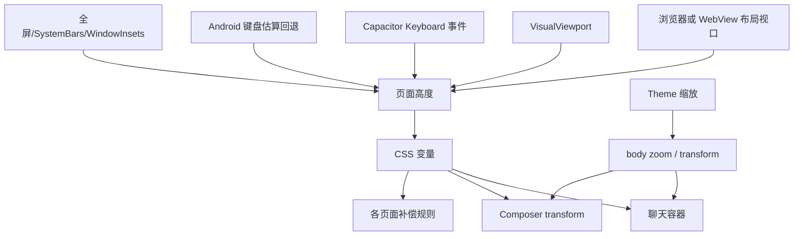
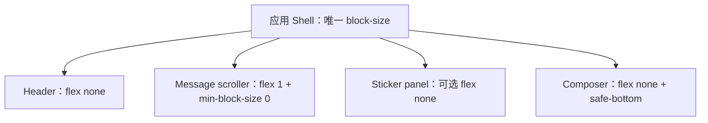

# LINK 跨平台稳定性与性能修复方案

> 方案日期：2026-08-02  
> 状态：设计与验收计划；**本文件不修改运行代码、原生配置、Service Worker、用户主题或本地数据。**  
> 目标：修复 iOS PWA 底部留白/输入异常、Android APK 卡顿，并把 Web PWA、Android APK、iOS IPA 的运行边界变成可验证、可回滚的契约。

## 1. 决策摘要

LINK 不需要推倒重写为三套独立应用。Vue、Vite、PWA、Capacitor、IndexedDB 和 TanStack Virtual 都可继续使用；问题在于同一件事存在多位“所有者”：视口高度、软键盘、系统栏、媒体加载、后台任务和版本更新都由多层逻辑同时处理。

本方案的核心是：

1. **每种运行形态的屏幕与键盘只有一个事实来源。**布局只消费一个标准化运行时快照，不再由 CSS、`visualViewport`、`innerHeight`、键盘事件、猜测高度和多个页面 transform 分别修正。
2. **聊天输入区留在同一个 flex 布局中。**正常情况下靠容器缩小而非“把输入框向上搬”；`VisualViewport` 只作为明确的 overlay 回退和诊断数据，不能成为所有平台的主布局引擎。
3. **本地数据按启动壳、会话索引、按需领域数据三层加载。**不再把全部 IndexedDB 数据和全部媒体在一次启动中装进全局响应式状态。
4. **PWA、APK、IPA 采用明确且可观测的版本协议。**禁止旧内嵌前端、线上前端和 Service Worker 缓存无感混用；更新不打断正在输入、通话或导入的数据。
5. **Themes 保持无限制 DIY。**不对白名单、选择器、`@import`、`position`、`transform`、根元素样式或用户 CSS 文本做过滤、限制、沙箱化、自动改写或强制覆盖。

本方案追求可控风险，不承诺不存在设备特例。移动浏览器、厂商 WebView、系统键盘和安全区不提供统一的零差异合约；成熟实践是把差异压缩在平台适配层，并用真机矩阵、灰度、指标和可回滚迁移持续管理。

## 2. 当前证据与根因

### 2.1 视口和输入区

当前 `src/app/viewport.ts` 同时读取 `visualViewport`、`innerHeight`、`offsetTop`、原生 Keyboard 事件和 Android 估算键盘高度；再将计算结果写回 CSS 自定义属性。`src/styles/main.css` 同时使用 `vh`、`svh`、`dvh`、固定 `html/body/#app` 高度、安全区、iOS PWA 缩放和键盘特例。私聊、群聊、线下页、选中工具栏和 Composer 又分别消费或覆盖 `--keyboard-inset`。

这会导致以下竞争：



对 iOS 主屏 PWA，`interactive-widget=resizes-content` 不能视为可依赖的键盘合约。MDN 的兼容性数据表明该 viewport 提示在 iOS Safari 和 iOS WebView 中不支持；`VisualViewport` 可用，但它代表可视视口而非必然变化的布局视口，并且官方示例明确提示用 transform 模拟 device-fixed 可能在滚动时闪烁。

### 2.2 Android APK

当前 Android 壳同时配置：

- Activity `adjustResize`；
- Capacitor Keyboard 原生 resize 及 `resizeOnFullScreen`；
- Capacitor `SystemBars` CSS inset 策略；
- 自定义 `LinkDisplayPlugin` 的 edge-to-edge、隐藏系统栏和多次延迟重放；
- Web 层的键盘高度推断、`--keyboard-inset` 和滚动定位。

Capacitor v8 的 Keyboard 文档指出：`resize` 是 iOS 的 resize mode；Android 的 `resizeOnFullScreen` 是 StatusBar 覆盖全屏时 WebView 无法正常随键盘缩小的专门 workaround。当前组合不能保证每层都只执行一次，因此出现跳动、双重缩小、底栏留白或输入框移位并不意外。

### 2.3 启动、内存与后台工作

`src/data/db.ts` 的 `loadSnapshot()` 并发 `getAll()` 读取 43 个 store；`src/stores/appStore.ts` 将完整快照归一化后进入全局响应式状态。首次没有 Service Worker controller 时，`hydrateStoredMediaRefs()` 还会递归读取存储媒体并创建 Object URL。

聊天虚拟列表已经降低了 DOM 数量，但完整消息、会话、媒体引用和跨领域数据仍驻留在 Store。根组件还在运行主动消息检查、备份检查、主题 watcher、保活以及可见性/网络恢复监听；启用 Keep Alive 时会以 15 秒周期恢复状态。

### 2.4 版本和更新

Capacitor 配置指向远程 `https://babylink.top`，而 Android/iOS 项目又各自带有本地 Web 资源。PWA 使用 Workbox `skipWaiting`、`clientsClaim` 和自动更新；`src/main.ts` 在 Service Worker controller 改变时直接刷新页面。这使以下状态可能同时存在：

- 服务端刚发布的新网页；
- 旧 Service Worker precache；
- 已安装 APK/IPA 的旧内嵌资源；
- 正在运行但尚未保存草稿的页面状态。

## 3. 非破坏性 Theme 兼容契约

### 3.1 必须保持的行为

Themes 是产品能力，不是应用样式的受限皮肤。实施任何修复时必须保持以下事实：

| 契约 | 必须保持 |
| --- | --- |
| CSS 能力 | 用户可写任意有效 CSS，包括 `html`、`body`、`#app`、任意组件选择器、自定义属性、媒体查询、动画、`position`、`transform`、`filter` 和 `@import`。 |
| 数据模型 | 现有全局、线上、线下主题预设及其导入/导出格式保持兼容，不重置、不删除、不静默改写。 |
| 注入方式 | 继续按既有全局/线上/线下作用域和层叠顺序注入；不改成 Shadow DOM，不给现有样式套 iframe，不把主题移到受限 CSS parser。 |
| 字体 | 自定义字体、缓存字体和用户选择的整体缩放值继续生效。 |
| 层叠权 | 不新增位于用户主题之后的全局 `!important` 布局覆盖层；正常 CSS 层叠仍由用户控制。 |

禁止采用下列“看似修复、实际破坏 DIY”的方案：

- CSS 白名单、黑名单、属性过滤、选择器过滤或 sanitizer；
- 将主题包裹进 Shadow DOM、`@scope` 或 iframe；
- 禁用用户对根元素、Composer、页面高度、定位、系统栏色彩或动画的修改；
- 为了稳定性把主题样式全部强制置于基础样式之前或之后；
- 自动删除疑似造成问题的主题规则。

### 3.2 无法消除的边界

“任意 DIY”与“任意 CSS 都保证布局不变”在逻辑上不能同时成立。例如用户主动写入 `body { height: 200px }`、`.composer { display: none }` 或 `#app { transform: rotate(90deg) }`，浏览器必须按用户 CSS 渲染。

因此验收边界是：

1. 默认主题、官方预设和不改变功能几何关系的自定义主题必须稳定；
2. 用户的自定义 CSS 继续拥有改变功能几何关系的自由；
3. 应用只提供**非侵入诊断**和用户主动的临时恢复入口，绝不自动修改主题内容、禁用主题或改变层叠顺序；
4. 平台修复本身不能依赖“主题没有覆盖这些属性”才能正常运行。

### 3.3 Theme Health：只报告，不干预

新增可选的本地诊断视图，不改变现有 Themes 编辑器语义：

- 显示当前环境、`visualViewport`、布局容器、Composer、键盘状态和安全区的实际几何值；
- 显示主题预设 ID 与内容 hash，不上传主题原文；
- 当根容器高度为零、Composer 超出可视区域、主题导致 `display:none` 等明显不可用状态时，仅提示“当前主题可能改变了页面几何”；
- 提供“本次会话以默认样式预览”操作，必须由用户点击，刷新后恢复原主题；
- 不写回设置、不删除预设、不限制保存、不阻止导入。

该能力既保护完全 DIY，也让用户能区分“平台布局缺陷”与“主题有意改变布局”的结果。

## 4. 目标运行时架构

### 4.1 一个 `LayoutRuntime`，一个发布者

新增纯运行时模块（建议 `src/app/layoutRuntime.ts`），将平台检测与几何采样统一为只读快照：

```text
LayoutRuntimeSnapshot
  environment: web | pwa-ios | pwa-android | native-ios | native-android
  viewportOwner: css-dynamic | native-webview-resize | visual-overlay-fallback
  layoutWidth, layoutHeight
  visualWidth, visualHeight, visualOffsetTop, visualScale
  safeTop, safeRight, safeBottom, safeLeft
  keyboardState: hidden | resizing | overlay | unknown
  keyboardOcclusion
  fullscreenState
  revision, sampledAt
```

规则：

1. 任何一次渲染只采用一个 `viewportOwner`；运行中 owner 不因一次临时事件在多个策略之间来回切换。
2. `LayoutRuntime` 是唯一可以写入 `--app-*` 平台几何变量的模块。
3. 页面、Composer、Sticker 面板和 Modal 只读取标准变量与容器尺寸，不再各自推断键盘高度。
4. 原生 Keyboard 事件、`visualViewport` 事件和 `resize` 事件只作为各环境对应 owner 的输入或日志，不能都触发独立补偿。
5. 采样统一通过 `requestAnimationFrame` 合并；不在每个 `scroll`、`focus`、`resize` 回调中同步测量并写样式。

### 4.2 以正常布局为首选，以回退为例外

核心聊天页面采用单一纵向 flex shell：顶部栏、可滚动消息区、可选 Sticker 区、Composer 都属于同一容器。消息区 `min-block-size: 0; flex: 1`，输入区不使用全局 fixed 定位，也不靠默认的负向 translate 跟随键盘。



各环境策略如下：

| 环境 | 布局 owner | 键盘策略 | `VisualViewport` 的角色 |
| --- | --- | --- | --- |
| 普通移动网页 / Android PWA | CSS 动态视口为主；`interactive-widget` 仅作浏览器提示 | 由 Shell 缩小，Composer 保持普通 flex 子项 | 记录和 overlay fallback，不与 CSS 高度双算 |
| iOS 主屏 PWA | CSS 动态视口为主；安全区来自 `env()` | 容器缩小优先；若系统仅遮挡可视视口，启用一条专属 overlay fallback | 只对需要避开遮挡的单个浮层计算，不改写整页 root 高度 |
| Android Capacitor | 原生 WebView resize | `adjustResize` 与单一 edge-to-edge owner 决定 WebView 可用高度 | 仅诊断；不再做猜测键盘高度 |
| iOS Capacitor | Capacitor Keyboard 的 iOS Native resize mode | 原生 WebView resize 为唯一键盘事实 | 仅诊断与焦点可见性检查 |

MDN 说明 `dvh` 会随浏览器动态 UI 改变而改变，这可能在滚动时触发界面尺寸变化和性能损耗；因此动态单位适合 Shell 高度，不适合在大量消息项、动画尺寸或每个子组件中反复参与复杂计算。`svh` 可作为不支持 `dvh` 的保守回退，`vh` 不能当作现代移动端的唯一高度语义。

### 4.3 缩放与输入控件

当前 iOS PWA 以 `body` transform 缩放实现全局 Theme scale。目标不改变主题的缩放能力和存储值，但必须消除“聚焦输入控件位于根 transform/zoom 几何链中”的平台耦合。

实施前先在真实 iOS PWA、iOS WebView、Android WebView 分别测试并选择下列兼容实现之一：

1. 使用由 Theme scale 驱动的密度变量，组件通过变量得到等价的间距、字号和圆角；
2. 将纯视觉内容缩放与交互 dock 分离，输入控件和系统避让层保持未 transform 的几何上下文；
3. 若必须保留完整渲染缩放，缩放只发生在稳定键盘隐藏状态，键盘打开时采用已验证的同等视觉布局，而不是对 `body` 临时切换 transform。

不能先假设某一方案正确。选择依据是：同一已保存 Theme scale 下，现有主题可见结果、文字可输入性、光标位置、选区、输入法候选栏和 Composer rect 在真机上都一致。

### 4.4 安全区和系统栏

`viewport-fit=cover` 需要配套 `env(safe-area-inset-*)`，不能只扩展到全屏。WebKit 的安全区指南明确要求对重要内容施加安全区 padding，并用 `max()` 保留普通边距。

目标规则：

- 网页/PWA：CSS `env()` 是安全区的权威来源；默认背景必须覆盖安全区，避免把正常 Home Indicator 区误判为“底部空白”。
- Android 原生：只保留一个 native edge-to-edge / SystemBars owner。该 owner 把稳定 WindowInsets 作为 CSS 变量发布，或让 WebView resize；不能由两个插件重复隐藏/显示系统栏。
- iOS 原生：原生控制器与 Keyboard plugin 的职责分开，状态栏和键盘避让不由主题 CSS 或页面脚本推断。
- 视觉全屏是可选展示偏好，不是布局前提。用户关闭全屏、手势唤出系统栏、分屏、多窗口或旋转时，Shell 都必须仍可用。

### 4.5 Modal、Sticker 和滚动锚点

- Modal、Picker、全屏通话、媒体浏览器统一消费 `LayoutRuntimeSnapshot`，不单独读取 `window.innerHeight`。
- Sticker 面板继续是 Composer 上方真实 flex 布局的一部分；其高度由自身容器或 `ResizeObserver` 决定，不根据键盘高度二次补偿。
- 虚拟列表只在“用户位于底部附近”时跟随新消息；键盘打开时保存一个逻辑锚点，布局稳定后最多恢复一次。
- 禁止组件链中叠加多次 `nextTick`、`requestAnimationFrame`、延时滚底来抵消同一布局变化；每种意图只有一个队列。

## 5. 数据、媒体与启动性能设计

### 5.1 数据访问分层

目标 Store 不再以“全库快照”作为默认启动路径：

| 层级 | 启动时加载 | 用途 |
| --- | --- | --- |
| 启动壳 | 设置、当前账号、主题、会话索引、每个会话最后摘要/未读数 | 立即渲染 Home 与主题，不等待全库 |
| 领域缓存 | 当前路由需要的会话、角色、消息首屏、Stickers、当前设置页模型 | 页面进入时按索引或 cursor 获取 |
| 后台索引 | 历史消息、Fanfic 章节、记忆图谱、商城、媒体健康、备份数据 | 空闲、显式搜索或对应页面请求时加载 |

具体要求：

1. 为消息使用既有 `byConversation` 索引增加按时间 cursor 的分页读取；首屏只读最近窗口，向上滚动再加载历史窗口。
2. Home 只读会话列表投影，不扫描 `messages` 全表计算每项最后消息。
3. `appStore` 按领域拆分为数据 repository、会话缓存、消息缓存、设置与跨域协调器；跨领域操作保留显式事务接口。
4. 仍可保存完整备份，但导出使用 repository 流式读取，而不是要求 UI Store 已装载所有实体。
5. 冷启动快照继续存在，但只保存允许快速恢复的轻量投影；主题、字体、会话摘要和草稿优先。

### 5.2 迁移和恢复不丢数据

任何 IndexedDB schema 或媒体引用变化必须遵守：

1. 首次迁移前创建可校验本地恢复点，并显示其结果；迁移失败不删除旧记录。
2. 新读路径先支持旧格式，再写入新格式；至少跨两个稳定版本保留旧 reader。
3. 清理任务仅在完整引用索引建立并成功校验后执行，绝不在只加载局部数据时将“不在内存中的媒体”视为垃圾。
4. 每一笔媒体迁移记录源 locator、目标 locator、字节数、hash、状态和可重试标记；OPFS、IndexedDB、Cache Storage 的写入采用幂等语义。
5. 导入、备份、媒体清理和数据库迁移共享锁与状态机，避免并发删除或覆盖。

### 5.3 媒体按显示面加载

Service Worker 能处理媒体路由时，消息和贴纸保持稳定的存储 URL；浏览器按 `img`、`audio` 或用户打开预览时才读取 Blob。没有 Service Worker controller 时，不应递归 materialize 全部快照：

- 首屏和可见虚拟窗口允许读取；
- 预加载应有字节与并发上限；
- 离开页面应释放不再使用的 Object URL；
- 音频需要 Range 的场景从单一媒体响应器读取；
- 大型媒体 hash、压缩和外部化放入可取消的后台任务，不占用输入交互帧。

### 5.4 后台任务调度

建立 `RuntimeWorkScheduler`，用单一队列协调主动消息、备份、媒体维护、模型刷新和状态检查：

- 任务明确声明前台/后台、网络、充电、空闲、会话是否活跃、最大并发和取消策略；
- 主动消息只扫描预先维护的“已启用且到期”的索引，不在每分钟遍历全部会话；
- 生成中的会话保留互斥锁；网络恢复、页面恢复和定时器合并为一次去重任务；
- Android Keep Alive 启用时由原生前台服务维持系统身份，Web 层不需要每 15 秒重复恢复相同原生状态；
- iOS/PWA 后台只能标记为尽力而为，界面不得承诺锁屏后按时执行；
- 自动备份、全库媒体维护和字体缓存仅在用户允许且设备空闲时运行，可取消、可恢复、可显示进度。

## 6. 版本、PWA 与原生壳策略

### 6.1 发布模型：先选择唯一产品承诺

必须在实施前确认下表中的产品选择，不能继续让“远程网页”和“本地历史 Web 包”在失败时无版本契约地互相替代：

| 模型 | 适用情形 | 要求 |
| --- | --- | --- |
| 统一远程 Web 运行时 | APP 是受鉴权网站的原生容器，更新需要快速同步 | APK/IPA 明确显示网络依赖；内嵌资源只提供版本明确的恢复页，不暗中运行旧 SPA；服务端按客户端最低兼容版本拒绝不兼容 API。 |
| 打包 Web 运行时 | APP 必须离线打开核心数据 | Capacitor 使用打包的 Web 资源；API/鉴权跨域、更新机制、数据隔离和原生包发布流程完整建设；PWA 与 APP 不承诺跨 origin 共享 IndexedDB。 |

以当前远程 `server.url` 架构，推荐先采用**统一远程 Web 运行时**：同一 Web build ID 服务于浏览器 PWA、Android WebView 和 iOS WebView；原生包只增加系统能力。若未来必须离线核心功能，再单独立项迁移到打包运行时，而不是把旧 `dist` 当作无版本 fallback。

### 6.2 build ID 与兼容握手

每次发布生成不可变 `buildId`、`schemaCompatibility` 和 `minNativeVersion`：

```text
ReleaseManifest
  webBuildId
  apiContractVersion
  indexedDbReaderVersions
  minAndroidNativeVersion
  minIosNativeVersion
  publishedAt
```

- 页面启动后读取 manifest，服务端返回当前兼容状态；
- 无法兼容时显示受控升级页，不加载半新半旧业务代码；
- 原生壳在启动、恢复、通知深链前读取同一契约；
- `Data` 页面显示 Web build、Service Worker build、native version 和数据库 reader 版本，便于远程排障；
- 发布产物生成 hash 清单，CI 校验服务器静态资源、PWA manifest 和原生包记录的版本关系。

### 6.3 更新不抢占用户交互

当前自动 `skipWaiting`、`clientsClaim` 与 controller change reload 不适合聊天产品。目标流程：

1. 发现新 Worker 后只下载并显示“新版本已就绪”；
2. 有草稿、正在输入、媒体上传、备份、导入、通话或请求中的 Agent 时不刷新；
3. 用户点击更新后，先同步草稿与关键 operation 状态，再执行 `SKIP_WAITING` 和一次刷新；
4. 新 Worker 激活不等于强制刷新所有页面；
5. 偶发的强制升级仅用于安全或数据协议不兼容，必须有明确原因和恢复路径；
6. Workbox/PWA 更新定期检查时处理离线、服务器不可达和短时间重复注册等边界。

## 7. 实施阶段与可回滚点

### Phase 0：基线、备份和观测

**目标**：先量化，不改变行为。

- 建立匿名、本地优先的运行时诊断：布局快照、键盘状态、Composer rect、滚动锚点、首屏阶段耗时、长任务、媒体读取量、数据库表计数和当前 build ID。
- Theme Health 只读报告上线；完整 CSS 原文不进入 telemetry。
- 为真实设备收集基线：启动、首次输入、键盘打开/关闭、切换 Sticker、滚动、发送、恢复和内存峰值。
- 执行并验证可恢复的完整本地备份；演练失败迁移、媒体缺失、旧版本读取和 Service Worker 回退。

**回滚**：仅新增观测开关，关闭即可；不迁移用户数据。

### Phase 1：建立 `LayoutRuntime` 并移除重复补偿

**目标**：默认 Theme 下消除底部留白、输入遮挡和重复位移。

- 先以 feature flag 接入 `LayoutRuntimeSnapshot`，旧逻辑仍保留为对照路径；
- 将私聊、群聊、线下页、Modal、Sticker 和选择工具栏改为消费统一快照；
- 将 Composer 与消息滚动区放入同一 flex shell；
- 逐个删除页面级 `--keyboard-inset` transform 和 iOS 仅私聊特例；
- 任何环境只保留一条 overlay fallback，且必须有相应的运行时原因码与真机复现证据；
- 保持 Theme 注入方式、选择器和层叠顺序不变。

**验收**：见第 8 节的键盘矩阵。若任何关键设备失败，按环境关闭新 owner，回到旧路径；不触碰数据。

### Phase 2：原生系统栏与键盘职责收敛

**目标**：Android/iOS 原生层不再与 Web 双算。

- Android 在 `adjustResize`、edge-to-edge、SystemBars 和 `LinkDisplayPlugin` 中选定唯一 owner；删除或停用其余重复控制逻辑。
- Capacitor Keyboard 仅按官方支持的环境设置；Android `resizeOnFullScreen` 仅作为已证实必要时的单点 workaround。
- iOS Native resize mode、系统状态栏和 Web Shell 的职责写入原生集成测试；不依赖 iOS PWA 的 `interactive-widget`。
- 每次原生改动执行 Capacitor sync，重建 APK/IPA，并把 native build ID 写入发布 manifest。

**回滚**：原生 feature flag 和上一稳定 APK/IPA 并存；新旧壳均能连接兼容的 Web build。

### Phase 3：版本协议与受控更新

**目标**：不再发生无感刷新和版本漂移。

- 部署 ReleaseManifest 与兼容握手；
- 将 PWA 更新改为用户确认式；
- 去除 controller change 的无条件 reload；
- 构建系统校验 Android/iOS 包、服务器 `dist`、PWA 预缓存的 build ID；
- Data 页面增加可复制的版本诊断包。

**回滚**：服务端保留前一兼容 Web build；manifest 可将新 build 标记为暂停，客户端继续旧兼容版本。

### Phase 4：Repository、按需加载和媒体迁移

**目标**：将全量启动替换为按需数据访问，且不丢用户数据。

- 先实现只读 repository 与分页消息 API；旧全量 Store 仍可对照；
- Home、Chat、Group、Offline 逐页迁移，所有跨领域写入经过统一事务协调器；
- 将启动维护改为增量引用索引；
- 媒体先双读、后双写、最后切换默认 reader；完成全量校验后才允许清理旧副本；
- 备份/导入覆盖新旧格式、媒体文件和中断恢复场景。

**回滚**：旧 reader 始终可用；迁移只新增数据，不删除旧 locator。数据删除需在至少两个稳定版本后另行发布。

### Phase 5：模块拆分与持续性能治理

**目标**：降低未来修改的耦合风险。

- 将 `appStore` 中的数据访问、消息缓存、AI 调度、媒体、钱包账本、主题、通知和备份协调拆为领域模块；
- 将私聊页面的通话、消息操作、媒体预览、AI trace、交易卡片和 Composer orchestration 拆为组件/服务；
- 为长列表、图片、滤镜和动画建立性能预算；
- 所有后台任务通过 `RuntimeWorkScheduler`。

**回滚**：每个领域模块保持同一公开接口与契约测试，避免大规模重写。

## 8. 验收矩阵与发布门槛

### 8.1 设备和运行形态

每个候选版本至少覆盖：

| 类别 | 必测形态 |
| --- | --- |
| iPhone | Safari 普通网页、主屏 PWA、刘海/动态岛设备、小屏设备、当前受支持的 iOS 主/次版本 |
| iPad | Safari 与主屏 PWA，竖屏/横屏、分屏或多任务、外接键盘（可获得时） |
| iOS Native | WKWebView 容器、冷启动、恢复、状态栏切换、通知深链 |
| Android Chrome | PWA、浏览器地址栏展开/收起、软键盘、全屏手势 |
| Android APK | API 最低支持版本、主流 API、目标 API；至少一台低内存设备及主流厂商 WebView |
| 桌面 | Chrome/Safari/Firefox 的响应式回归，作为快速预检，不替代真机 |

### 8.2 键盘和布局用例

对私聊、群聊、线下 RP、设置文本域、Modal、Sticker、媒体预览逐一执行：

1. 冷启动后首次 focus；
2. 中英文输入法切换、候选词、语音输入、emoji；
3. 连续输入、textarea 自动增长、发送、撤回 focus；
4. 键盘显示/隐藏期间切换 Sticker、弹窗、菜单和页面；
5. 底部、历史中部、顶部三种消息滚动位置；
6. 系统栏显示/隐藏、地址栏展开/收起、旋转、分屏、锁屏恢复；
7. Theme scale 为默认、最小、最大，以及用户自定义 CSS 三种样本；
8. 断网、弱网和 Service Worker 更新提示期间保留草稿。

每一步采集：`LayoutRuntimeSnapshot`、根 Shell、消息区、Composer、系统安全区的 rect；判定输入可见且可点击、没有额外空白、消息锚点正确、没有超过一帧的持续跳动。

### 8.3 性能与数据门槛

先在 Phase 0 用参考设备录制当前 P50/P75/P95，再为每类设备定目标。发布最小门槛：

- 冷启动和路由首屏不再被全库 hydration 阻塞；
- 输入、滚动和打开聊天过程中无可归因于本应用的持续长任务；
- 首屏只读取必需的数据库记录和可见媒体；
- 任何迁移、导入、清理和升级都可恢复，媒体 hash 与计数一致；
- 默认 Theme 与所有既有官方预设视觉回归通过；
- 自定义 Theme fixture 不被篡改、拒绝、重排或静默禁用；
- 新 Worker 不会丢失草稿或无提示刷新；
- 线上 Web、PWA、APK、IPA 的 build ID/兼容协议符合发布规则。

## 9. 观测、隐私与故障处理

### 9.1 最小观测事件

建议本地记录并允许用户在 Data 页面主动导出；远程上报须另行征得同意：

```text
layout_sample
  buildId, nativeVersion, environment, viewportOwner,
  layout/visual dimensions, safe insets, keyboard state,
  active route category, composer visibility, theme hash

startup_stage
  buildId, stage, elapsedMs, loaded record counts, media bytes

work_item
  type, trigger, state, elapsedMs, cancellation reason

update_state
  old/new buildId, worker state, user confirmation, draft preserved
```

不得记录聊天内容、API key、Cookie、Theme CSS 原文、图片、音频、联系人、QQ 号或精确地理位置。Theme 仅使用本地 hash 和预设 ID，以便定位“某主题影响布局”而不泄露用户代码。

### 9.2 故障优先级

| 级别 | 示例 | 处置 |
| --- | --- | --- |
| P0 | 本地数据丢失、无法输入、更新循环、启动白屏 | 立即暂停新 feature flag 或 manifest，保持旧 reader/旧 build，导出诊断与恢复数据 |
| P1 | 特定主流设备键盘遮挡、严重卡顿、通知深链失效 | 按运行形态关闭新布局路径，保留局部 workaround，安排热修复 |
| P2 | 个别主题导致视觉几何异常、非关键页性能下降 | Theme Health 提示与会话级恢复预览；不自动修改用户 CSS |

## 10. 推荐代码组织（授权实施后）

以下是建议的增量落点，不代表本次已创建这些文件：

```text
src/app/runtimeEnvironment.ts       运行形态识别与 build compatibility
src/app/layoutRuntime.ts            唯一几何快照和事件合并
src/app/runtimeWorkScheduler.ts     后台工作队列
src/data/repositories/              IndexedDB 领域 repository 与分页查询
src/data/migrations/                可恢复、可审计的数据迁移
src/stores/sessionStore.ts          启动壳、当前用户、路由级缓存
src/stores/conversationStore.ts     会话/消息窗口/锚点
src/services/releaseManifest.ts     Web/native 版本握手
src/services/runtimeDiagnostics.ts  本地诊断与导出
src/services/themeHealth.ts         只读 Theme 几何检测
src/components/layout/AppShell.vue  统一 flex shell
```

保留既有 `src/utils/themeStyles.ts`、Theme 设置数据和注入入口的功能边界；新模块只能消费主题结果或报告冲突，不能把 Theme 变成受限 DSL。

## 11. 方案依据（截至 2026-08-02 访问）

- [Capacitor v8 Keyboard](https://capacitorjs.com/docs/apis/keyboard)：区分 iOS resize mode、Android 全屏 workaround 与 keyboard event 行为。
- [MDN: VisualViewport](https://developer.mozilla.org/en-US/docs/Web/API/VisualViewport)：说明 layout/visual viewport 的区别，以及 transform 模拟 fixed 元素存在闪烁风险。
- [MDN: viewport meta](https://developer.mozilla.org/en-US/docs/Web/HTML/Reference/Elements/meta/name/viewport)：`interactive-widget`、`viewport-fit` 与兼容性；iOS 不支持 `interactive-widget` 的各 resize 值。
- [MDN: viewport length units](https://developer.mozilla.org/en-US/docs/Web/CSS/length#viewport-percentage_lengths)：`svh`/`lvh`/`dvh` 的语义与动态单位滚动性能注意事项。
- [WebKit: Designing Websites for iPhone X](https://webkit.org/blog/7929/designing-websites-for-iphone-x/)：`viewport-fit=cover` 和安全区 `env()` 的使用原则。
- [Vite PWA: Periodic Service Worker Updates](https://vite-pwa-org.netlify.app/guide/periodic-sw-updates.html)：更新检查的离线、重复注册和自动更新边界。

## 12. 实施前必须确认的产品决策

1. Android/iOS 是否正式承诺离线打开完整业务，还是明确采用统一远程 Web 运行时？
2. Theme scale 的兼容目标是“视觉等价”还是“现有 `body` transform 的像素级实现不变”？前者可修复输入几何，后者会保留 iOS 风险。
3. 主动消息、保活和自动备份的可接受延迟、耗电边界和后台承诺分别是什么？
4. 哪些 iOS/Android 系统版本与设备是正式支持范围，哪些仅尽力兼容？
5. 是否接受先发布 Theme Health 和会话级恢复预览，以便在不限制 DIY 的情况下快速定位故障主题？

在这些决策确认前，不应直接进行全量重构或数据库清理。正确顺序是：可观测、可回滚、小范围灰度、真机验证、逐阶段扩大，而不是一次性“修完所有平台”。